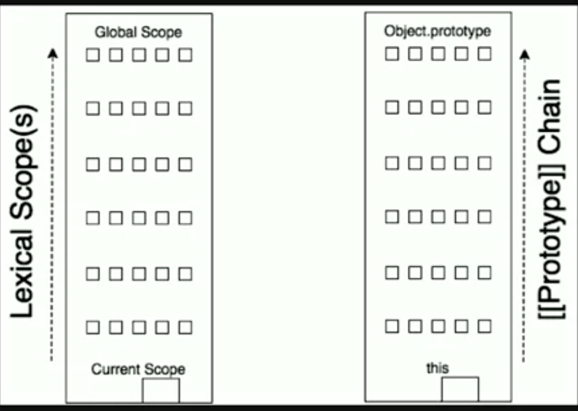

### discuss `this`:

- this in
  - global context
  - object method
  - simple function
  - arrow function
  - event listener
  - object construction


1. Global Context:

```js
function f1() {
  console.log('this: ', this); // window / global
}

f1();
```

2. Object Method:

```js
const ob = {
  name: 'Alice',

  f1: function () {  // method
    console.log('this: ', this.name);
  }
}

ob.f1();

```

3. Simple Function

```js
function simpleFunc() {
  console.log('>>>>>>>>', this);
}

const ob = {
  name: 'Alice',

  f1: function () {  // method
    simpleFunc();
  }
}

simpleFunc(); // window
ob.f1();      // window
```

- another exap:

```js
const ob = {
  name: 'Alice',

  doSomethingLater: function () {
      // this.f1(); // ob

    setTimeout(function() {
      this.f1(); // Error
    }, 1000);
  },

  f1: function () {
    console.log('this: ', this);
  }
}

ob.doSomethingLater();
```

- Using `strict mode`:

```js
function simpleFunc() {
  'use strict'
  console.log('>>>>>>>>', this);
}

simpleFunc(); // ??
```

4. Arrow Function:

```js

// ES5
const multiplyByFive = function (val) {
  return val * 5;
}

// ES6, arrow function
const multiplyByFive = val => val * 5;

------

const f1 = function (x, y) {
  return x + y;
}
// ES6, arrow function

const f1 = (x, y) => x + y
```

this in Arrow function:
-----------------------

```js
const ob = {
  name: 'Alice',

  doSomethingLater: function () {
      // this.f1(); // ob

    setTimeout(() => {
      this.f1(); // this = ob, cause used arrow
    }, 1000);
  },

  f1: function () {
    console.log('this: ', this);
  }
}

ob.doSomethingLater();
```

#### Apply(), call(), bind()


```js
function f1(x, y) {
  console.log(this.name);
  console.log('Sum: ', x+ y);
}

const ob1 = {
  name: 'Alice',
  f2: function () {
    console.log();
  }
}

const ob2 = {
  name: 'Bob',
  f3: function () {
    console.log();
  }
}

f1.call(ob1, 1, 2); // Alice
f1.call(ob2, 3, 4); // Bob

// f1.apply(ob1, [1, 2]); // Alice
// f1.apply(ob2, [3, 4]); // Bob

```

```js
// use bind
function f1() {
  console.log(this.name);
  // console.log('Sum: ', x+ y);
}

const ob1 = {
  name: 'Alice',
  f2: function () {
    console.log();
  }
}

const ob2 = {
  name: 'Bob',
  f3: function () {
    console.log();
  }
}

const a = f1.bind(ob1);

a.apply(ob2);
```

5. Event Listener

```js
const btn = document.querySelector('button');

button.addEventListener('click', function(e) {
  // const el = $(this.closest('img'));
  console.log('this: ', this); // button
});
```

6. This in object construction (`new` keyword)

```js

function F1(name) {  // camelCase
  this.name = name;

}

const ob1 = new F1('Alice');
console.log('ob1: ', ob1);

const ob2 = new F1('Bob');
console.log('ob2: ', ob2);

```

#### What are the **`four`** things the `new` keyword actually does when we put in front of a function call (**aka: constructor call**)?

1. Create a brand new empty object (aka constructed) out of thin air.
2. Newly created/constructed object is linked to (`[[Prototype]]`) the function's prototype.
3. Newly created/constructed object is set as the `this` binding for that function call.
4. Unless the function returns its own alternate object, the new-invoked call will automatically return the newly constructed object.

```js
function Human(age) {
    this.age = age;
}

const h1 = new Human(10);
const h2 = new Human(20);

console.log(h1); // this.age = 10
console.log(h2);   // this.age = 20
```


